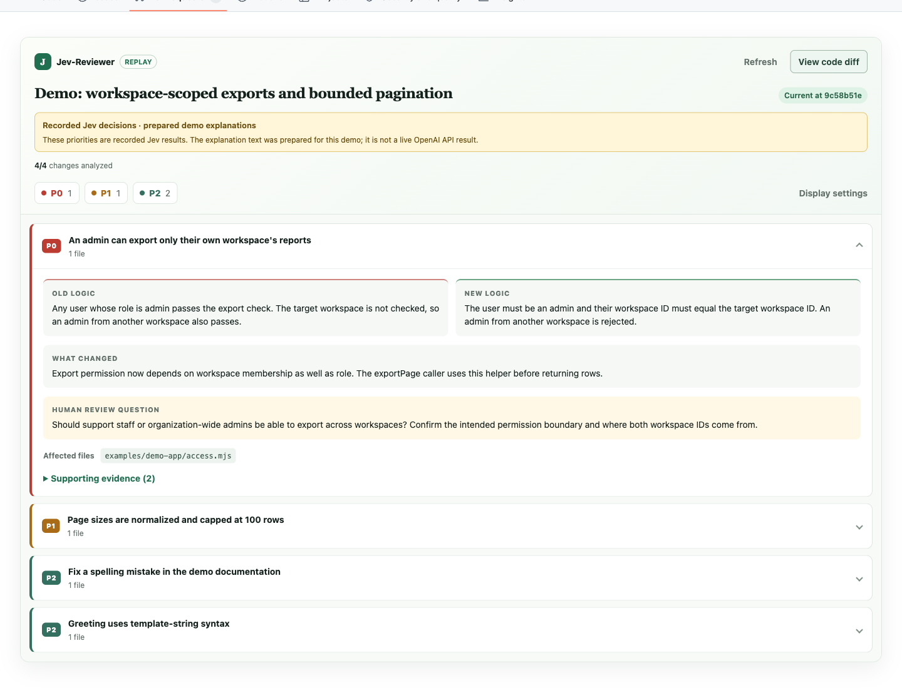

# Jev-Reviewer

**Your agent wrote the code. You make the call.**

Jev-Reviewer turns a GitHub pull request into a set of behavioral changes:

- **Old logic** — what the committed code used to do.
- **New logic** — what it does after the change.
- **What changed** — the difference in behavior.
- **Human review question** — the decision or assumption to inspect.

**TypeSafe Jev assigns attention priorities. OpenAI writes the explanations.** P0 cards open automatically; P1 and P2 start collapsed. Supporting code remains available. The priorities suggest where to spend attention, not whether code is correct.

This is an early, open-source demo for reviewing **your own coding agent's PRs on the same computer**. It does not publish PR comments or send a report to teammates.



[Watch the 25-second demo](https://github.com/egma-ai/jev-reviewer/blob/main/docs/demo.mp4) · [Open the demonstration PR](https://github.com/egma-ai/jev-reviewer/pull/1)

The recording uses real Jev classifications and clearly labeled prepared explanation copy. Live OpenAI explanations are implemented but verification is pending funded API access; see [demo provenance](demo/README.md).

## Quick demo

Requirements: Node.js 22 or newer.

```sh
git clone https://github.com/egma-ai/jev-reviewer.git
cd jev-reviewer
npm install
npm run demo
```

Open **http://127.0.0.1:4731/demo**. The bundled replay is explicitly labeled and makes no provider calls. Its provenance is included in `demo/README.md`.

## Use on a real PR

Install [GitHub CLI](https://cli.github.com/) and sign in with `gh auth login`. Keep a local clone of the PR's base repository, with `origin` pointing to that GitHub repository. Historical PRs work too; the CLI fetches missing commits without checking out another branch.

```sh
# Optional command alias; otherwise use node /path/to/jev-reviewer/bin/jev-reviewer.mjs
npm link

# Enter keys in your own terminal, never in an agent chat.
jev-reviewer setup

# Recommended: local static context graph, no extra model key.
uv tool install graphifyy

# Start the local browser bridge in a terminal and leave it running.
jev-reviewer serve
```

In a second terminal or through the installed skill:

```sh
jev-reviewer analyze \
  --pr https://github.com/OWNER/REPOSITORY/pull/123 \
  --repo /path/to/local/clone
```

The CLI uses **`TYPESAFE_API_KEY`** and **`OPENAI_API_KEY`** from the local setup file, falling back to environment variables. Optional model overrides: `JEV_MODEL` and `OPENAI_MODEL`. Live analysis sends the selected committed code, diff, and context to TypeSafe and OpenAI. Graphify runs locally in `--code-only` mode. It is a structural aid, not a complete runtime dependency map.

Keys entered through setup are saved to `~/.config/jev-reviewer/credentials.json` with owner-only permissions. This file is outside the repository and **not encrypted**. Saved keys take precedence over inherited environment variables. To replace an exhausted OpenAI key, run `node scripts/setup-keys.mjs --replace-openai` locally. Reports, which contain code excerpts, are stored in `~/.cache/jev-reviewer/reviews` with owner-only file permissions.

## Load the Chrome extension

1. Open `chrome://extensions` and enable **Developer mode**.
2. Click **Load unpacked** and select this repository's `extension/` folder. No build or store publication is needed.
3. Run `jev-reviewer token` locally and copy the pairing token. This is a separate local token, not either model API key.
4. Open the PR's **Files changed** page, expand **Set pairing token**, paste it, and save.

The extension fetches the report from `127.0.0.1:4731`. It does not access your filesystem or model credentials. Refresh reloads an existing report; there is no "Analyze PR" button. The CLI/agent generates the report.

## Install the agent skill

See [installation instructions](install/README.md) for Codex and Claude Code. The skill instructs your coding agent to run the review step after creating or updating a PR. This is agent guidance, **not a guaranteed PR event hook**. For other agents that support `SKILL.md`, use the canonical `skill/jev-reviewer/` directory.

## Configure priorities

Copy `config/policy.json` to `.jev-reviewer.json` in the repository you review, or pass `--policy /path/to/policy.json`.

| Level | Default meaning | Default display |
| --- | --- | --- |
| P0 | Human judgment required: security, permissions, destructive behavior, consequential contracts | Expanded |
| P1 | Human review recommended: bounded behavioral changes | Collapsed |
| P2 | Low attention: documentation, mechanical changes, clear behavior preservation | Collapsed |

Edit the priority descriptions and `instructions` to steer Jev. `alwaysReviewPaths` applies deterministic P0 overrides. Incomplete changed code is escalated to `uncertainPriority` (P0 or P1, never P2). Display preferences can also be changed in the extension. Priority levels are **review attention**, not bug severity.

## Scope and limitations

- Units are diff hunks with surrounding old/new committed source. Related source and Graphify neighbors provide bounded context. Cross-hunk behavior can still be missed.
- Up to 12 units are analyzed by default. Excess units remain visible as **P0 / not analyzed**; increase `--max-units` explicitly for larger PRs.
- The Graphify snapshot is head-only, bounded to 500 supported code files / about 5 MB. Missing Graphify or unsupported source is surfaced in the report.
- The report records base/head commits. The extension flags a stale report when the page exposes a different head; otherwise it says freshness is unverified. Always verify the revision before relying on a report.
- The demo supports github.com and a local clone. No GitHub App is required. Remote/cloud agents need an additional transport and are outside v0.1.
- Private repositories use your existing local GitHub access. This is local report delivery, **not fully offline analysis**: provider requests transmit source context.
- API failures are explicit; the live command never silently substitutes a fixture for a provider result.

## Development

```sh
npm test
node scripts/test-extension.mjs
```

See [architecture](docs/ARCHITECTURE.md), [demo guide](docs/DEMO.md), and [extension details](extension/README.md). Runtime uses Node's built-in modules; Playwright is a development dependency for browser verification.

The extension browser test needs Chromium (`npx playwright install chromium`, or set `CHROMIUM_PATH`) and port 4731 free. It uses an isolated browser profile and synthetic fixtures; real-provider evidence is documented separately in `demo/README.md`.

MIT licensed. Independent project; not affiliated with TypeSafe, OpenAI, GitHub, or Graphify.
